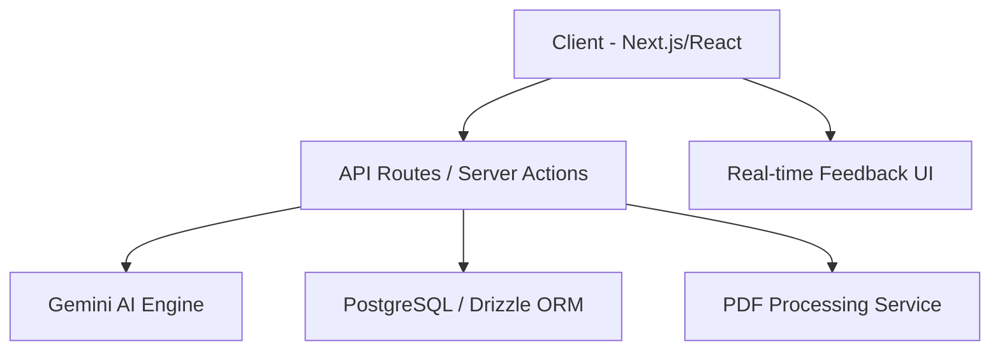

# AI Mock Interview Platform 🚀

A premium, industrial-grade AI interview simulation platform built with **Next.js**, **Google Gemini**, and **Drizzle ORM**. Prepare for high-stakes technical and behavioral interviews with real-time feedback, personalized questions, and data-driven analytics.


## ✨ Features

- 👤 **Resume & JD Intelligence**: Upload your PDF resume or paste a Job Description. Our AI extracts key technical skills and experiences to generate hyper-personalized questions.
- 🎭 **Dual Interview Modes**:
  - **Technical Focus**: Deep dives into your tech stack and problem-solving abilities.
  - **Behavioral Focus**: Soft skills practice using the **STAR method** (Situation, Task, Action, Result).
- 🎙️ **Premium Interview Experience**: High-fidelity 40/60 split-screen layout (HireVue style) with real-time timer, pulsing recording indicators, and "Retry" functionality.
- 📊 **Performance Analytics**: 
  - Visualized score trends with interactive charts.
  - Overall growth index and peak performance tracking.
  - 7-day practice streak system.
- 📄 **Professional Assessment Reports**: Comprehensive feedback including score circles, insight cards for Strengths/Weaknesses, and "Evolution Maps" for improvement.
- 📥 **PDF Export**: Download your full interview assessment as a professional report.

## 🛠️ Tech Stack

- **Framework**: Next.js 14+ (App Router)
- **AI Engine**: Google Gemini Pro API
- **Database**: PostgreSQL (Neon.tech) with Drizzle ORM
- **Authentication**: Clerk / Custom Auth Context
- **UI & Styling**: Tailwind CSS, Shadcn UI, Framer Motion
- **Icons**: Lucide React
- **Data Visualization**: Recharts
- **Document Processing**: pdf-parse, jspdf, html2canvas

## 🚀 Getting Started

### Prerequisites

- Node.js 18+
- A Google Gemini API Key
- A PostgreSQL database (Neon recommended)

### Installation

1. **Clone the repository**:
   ```bash
   git clone https://github.com/your-username/ai-mock-interview.git
   cd ai-mock-interview
   ```

2. **Install dependencies**:
   ```bash
   npm install
   ```

3. **Set up Environment Variables**:
   Create a `.env.local` file in the root directory (use `.env.example` as a template).

4. **Sync the Database**:
   ```bash
   npm run db:push
   ```

5. **Run the development server**:
   ```bash
   npm run dev
   ```

Open [http://localhost:3000](http://localhost:3000) to see the application.

## 📁 Architecture Overview



## 📸 Screenshots

*Add your high-quality screenshots here to showcase the premium UI.*

## 📄 License

This project is licensed under the MIT License.
